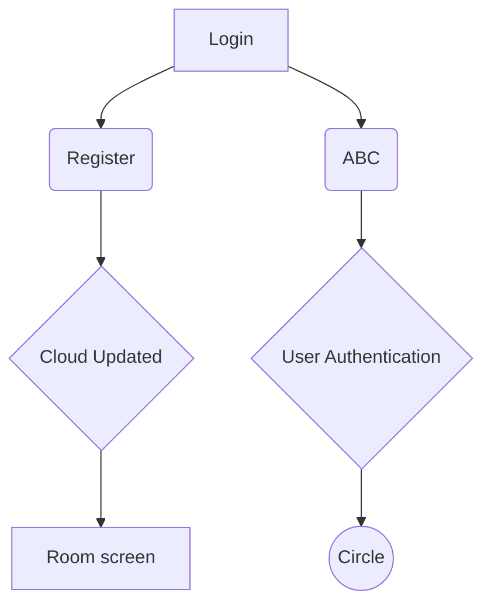

# Mahallah Friend Finder
### **INFO 4335 - FINAL ASSESSMENT**
> 1912092 — Ayuni Humairaq Mustafa,

> 1817162 — Rowda Hassan Sayid Ahmed,

> 1712046 — Nur Syaza Wahidah binti Abdul Aziz.

### Introduction

FriendFinder connects and shares your location with your roommates.

### Objectives

Objectives

### Features and Functionalities

* Firebase Authentication
	* User Login (Phone number)
* Location permission prompt
* User Registration (Firebase Cloud)
	* Choose dorm (mahallah)
	* Choose block, level, room
* A

### Screen Navigation
LR

### Widgets

Widgets

### Sequence Diagram

Sequences Diagram

## References

References
