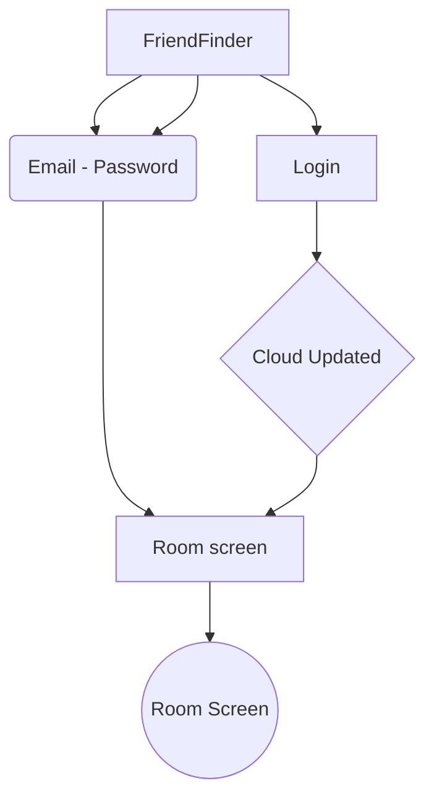

# Mahallah Friend Finder
### **INFO 4335 - FINAL ASSESSMENT**
> 1912092 — Ayuni Humairaq Mustafa,
>
> 1817162 — Rowda Hassan Sayid Ahmed,
>
> 1712046 — Nur Syaza Wahidah binti Abdul Aziz.

### Introduction

FriendFinder is a mobile app that allows students to track the location of their friends. This app designed to provide users with real-time information about the whereabouts of their roommates. Also, giving them peace of mind and a sense of security by connecting and sharing your location with your roommates.

### Objectives

Objective
* Application for students living in dorms to know the location of their roomates when students are worried whereabouts and safety of roomates. 

### Features and Functionalities

* Firebase Authentication
	* User Login (Email&Password)
	* Login and logout redirect screens
* Location permission prompt
* User Registration (Firebase Cloud)
	* Enter details in registration form 
* User profile
    * Students profile
	* Roomate profile
	* Location widget

### Screen Navigation
LR

### Widgets

Widgets
* CircleProgressIndicator
* LinearProgressIndicator
* https://pub.dev/packages/geolocator
* https://pub.dev/packages/geocoding/example

### Sequence Diagram

Sequences Diagram

## References

References

//SYAZA
* https://www.youtube.com/watch?v=rWamixHIKmQ
* https://www.youtube.com/watch?v=4vKiJZNPhss
* https://www.youtube.com/watch?v=u8H652UY-L8
* https://firebase.flutter.dev/docs/auth/usage/
* https://medium.com/codechai/playing-with-appbar-in-flutter-3a8abd9b982a
* https://www.youtube.com/watch?v=0yykOVwHV7c
* https://www.youtube.com/watch?v=y4_x6Ss8gOE
* https://www.youtube.com/watch?v=TcZ-KDP4bDM

//ROWDA
* https://youtu.be/OQQFZu972iU
* https://youtu.be/zn2vHRbWszY
* https://youtu.be/u2g5jfe7UVg
* https://youtu.be/qWjnxjB-sTA
* https://youtu.be/9nw5yGrBbw4

//AYUNI
* https://www.youtube.com/watch?v=7A8d8o2hHEI&t=231s
* https://www.youtube.com/watch?v=ZOX2yD5Z3LA
* https://www.youtube.com/watch?v=sOVgPx8ljaE
* https://www.youtube.com/watch?v=_3W-JuIVFlg&t=477s
* https://www.youtube.com/watch?v=_3W-JuIVFlg
* https://pub.dev/packages/date_time_picker

## Work Delegation

//SYAZA
* Login page
* Loginsuccess page
* Widget 
* Authentication class
* Widget tree class
* Main class
* Routes class

//ROWDA
* Profile page
* Room page
* Room class
* Database

//AYUNI
* Loginsignup page
* Logout page
* Widget
* Student class
* Database

